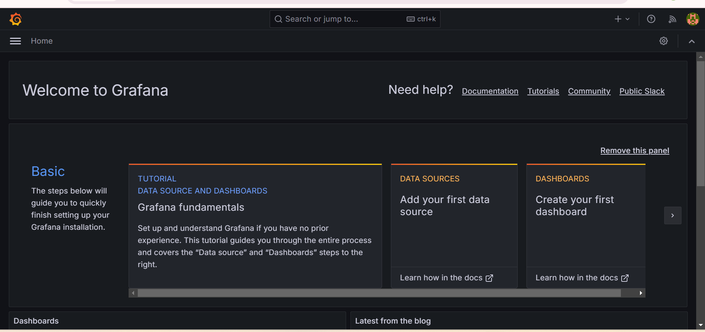

# Complete DevOps Project in Deploying a Full-Stack FastAPI and React Template

Welcome to the Full-Stack FastAPI and React template application deployed on Amazon Web Services (AWS) Elastic Kubernetes Service (EKS). This document provides a detailed introduction and instruction to the deployment, highlighting the key components and technologies involved. This repository serves as a demo project for a complete end-to-end DevOps processes, ranging from infrastructure provisioning using terraform, unit test code, vulnerability scanning, containerization, image scan, container orchestration, logging, monitoring and alert system, showcasing how to use various DevOps technology to set up and run a full-stack application with a Postgres Database, FastAPI backend and a ReactJS frontend using ChakraUI.


Welcome to the official README for the Three-tier Fastapi Application

Application: This application is containerized as a Docker image on Amazon ECR private repository  and deployed on AWS EKS using Kubernetes.

## Deployment Structure
The deployment consist of the following components
# Components

| Component                  |  |
|----------------------------|----------|
| 1. VPC                     |    ✅   |
| 2. Private and Public Subnets |  ✅   |
| 3. Route Tables            |    ✅   |
| 4. NAT Gateways            |    ✅   |
| 5. Load Balancers          |    ✅   |
| 6. EC2 Instance (Node)     |    ✅   |
| 7. EKS                     |    ✅   |

| Component                  | Required |
|----------------------------|----------|
| 1 Service                     |    ✅   |
| 1 Deployment |  ✅   |
| 3 Pods            |    ✅   |

## Getting Started 

### Prerequisites

Before you begin, ensure you have the following prerequisites in place:

1. **Ubuntu Linux Machine**: This Deployment is designed to run on an Ubuntu Linux machine. Ensure you have an Ubuntu-based system available.

2. **AWS CLI Installed and Access Keys Configured**: To interact with AWS services, you'll need the AWS Command Line Interface (CLI) installed on your machine. Additionally, configure your AWS access keys to authenticate with AWS. You can set up access keys using the `aws configure` command.

3. **Terraform Installed**: This project relies on Terraform for infrastructure provisioning. Make sure you have Terraform installed on your Ubuntu machine. You can find installation instructions for Terraform on the [official Terraform website](https://www.terraform.io/downloads.html).

4. **Kubectl Installed**:   This project requires kubectl to run kubernetes deployment command. It allows you to send a querry to the kubernetes api. Install Kubectl by [visiting this official kubernetes documentation](https://kubernetes.io/docs/tasks/tools/install-kubectl-linux/)

5. **Helm Installed**: Helm is required for managing multiple production environment like dev, staging, qa and prod. helm can be installed by visiting the [helm offical documentation](https://helm.sh/docs/intro/install/)


# STEP1 (Infrastructure Provisioning)
Before you begin this, a basic understanding of terraform is required. Look into the terraform script and change the variables to suite your deployment.
Clone this repository and run aws configure in your server by running the command:

```
aws configure
#use your iam secret key, access key and region to set up permission for this jump server.
```

```
git clone https://github.com/akurasy/devops-complete.git
```

change directory to the terraform directory where all infrastructure code is kept.

```
cd Terraform
```

run the following commands to provision your infrastructure 

```
terraform init
terraform plan
terraform apply --auto-approve
```


# STEP2 (Connect to the cluster and run your Continous Integration with Github Actions)

connect the cluster with the command 

```
aws eks update-kubeconfig --name zik-cluster --region us-east-1

#the name of my cluster is zik-cluster and the cluster is deployed in us-east-1 region
```


After connecting to the cluster, we need to set up our CI using Github Actions to run the unit test code, scan the application for vulnerability using sonarqube, build the application with docker, scan our docker image with trivy and push the image to ECR repository. before deploying this CI, we need to set up a sonarqube server using docker. install docker and deploy sonarqube using the commands below

```
sudo apt install docker.io -y  #docker installation
```

```
sudo docker run -d --name sonar -p 9000:9000 sonarqube #this will deploy sonarqube with latest tag
```

browse sonarqube with the public IP address of your server on port 9000

http://Public-IP-Address:9000

login username = admin

login password = admin123


on the sonarqube server, click on project ===> input the project name and click next =====> select global settings and click next ====> create a token for your project by selecting local project (copy and save this token) click continue =====> and click on other language or select the programming language you want to scan. The sonarqube scan command will show after creating the project, you will copy this command and save to use in your github actions pipeline.


Sonar successfully passed quality gate


# Now lets run our CI
Before we begin, you need to create a secret for your pipeline. To create a secret, click on settings, on the bottom left, under secrets click on actions, scroll down to repository secrets and select new repository, create a secret for your aws secret key, aws access key, sonarqube token (for frontend and backend), github token, aws ecr repository name (for frontend and backend), aws region, docker hub username and docker hub token.   After this, goto this repository, click on actions and open a workflow tab to write your pipeline. You can give the flow any name you want, but the workflow directory has the naming convention ".github/workflows/name-of-workflow.yaml" .


Paste the below script for your CI pipeline named frontend.yaml. we are only creating this for the dev environment, so we created a github branch called "dev" . 

```
name: CI/CD Pipeline for Frontend-dev.

on:
  push:
    branches:
      - dev
    paths-ignore:
      - 'Kubernetes/**'
      - 'Terraform/**'
      - 'README.md'
      - '.github/workflows/backend.yaml'
  pull_request:
    branches:
      - dev

jobs:
  sonarcloud_scan:
    runs-on: ubuntu-latest
    steps:
      # Set up Java 17
      - name: Set up JDK 17
        uses: actions/setup-java@v3
        with:
          distribution: 'temurin'
          java-version: '17'

      # Checkout the repository
      - name: Checkout repository
        uses: actions/checkout@v3

      # Install unzip
      - name: Install unzip
        run: sudo apt-get install -y unzip

      # Install SonarScanner
      - name: Install SonarScanner
        run: |
          wget -qO- https://binaries.sonarsource.com/Distribution/sonar-scanner-cli/sonar-scanner-cli-5.0.1.3006-linux.zip -O /tmp/sonar-scanner.zip
          unzip /tmp/sonar-scanner.zip -d /tmp
          echo "/tmp/sonar-scanner-5.0.1.3006-linux/bin" >> $GITHUB_PATH

      # SonarQube Scan
      - name: SonarQube Scan
        env:
          SONAR_TOKEN_FRONTEND: ${{ secrets.SONAR_TOKEN_FRONTEND }}  #this is gotten from soanrqube configuration we did on soanrqube server.
        run: |
          sonar-scanner \
            -Dsonar.projectKey=frontend \     #our project name on sonarqube
            -Dsonar.sources=./frontend \    #the path we want to scan. this will ensure only the frontend directory is scanned.
            -Dsonar.host.url=http://3.80.111.197:9000 \ #replace 52.91.52.173 with your own public IP of youir sonarqube server.
            -Dsonar.login=$SONAR_TOKEN_FRONTEND  

  docker_build_scan_push:
    needs: sonarcloud_scan
    runs-on: ubuntu-latest
    env:
      AWS_REGION: ${{ secrets.AWS_REGION }}
      ECR_REPOSITORY: ${{ secrets.ECR_REPOSITORY_FRONTEND }}
    steps:
      # Checkout the repository
      - name: Checkout repository
        uses: actions/checkout@v3

      # Install AWS CLI (if needed for additional AWS commands later)
      - name: Install AWS CLI
        run: sudo apt-get install -y awscli

      # Configure AWS credentials using GitHub secrets
      - name: Configure AWS credentials
        uses: aws-actions/configure-aws-credentials@v1
        with:
          aws-access-key-id: ${{ secrets.AWS_ACCESS_KEY_ID }}
          aws-secret-access-key: ${{ secrets.AWS_SECRET_ACCESS_KEY }}
          aws-region: ${{ secrets.AWS_REGION }}

      # Login to Amazon ECR
      - name: Login to Amazon ECR
        id: login-ecr
        uses: aws-actions/amazon-ecr-login@v1

      # Log in to DockerHub with Token
      - name: Log in to DockerHub with Token
        uses: docker/login-action@v2
        with:
          username: ${{ secrets.DOCKERHUB_USERNAME }}
          password: ${{ secrets.DOCKERHUB_TOKEN }}

      # Build Docker image
      - name: Build Docker image
        run: |
          docker build -t frontend ./frontend

      # Tag Docker image with the correct ECR repository URI
      - name: Tag Docker image
        id: tag-image
        run: |
          IMAGE_URI=${{ secrets.ECR_REPOSITORY_FRONTEND }}:${{ github.sha }} # This will tag your docker image with the last commit hash
          echo "Image URI is: $IMAGE_URI"  # Debugging: Print IMAGE_URI value
          docker tag frontend $IMAGE_URI
          echo "IMAGE_URI=${IMAGE_URI}" >> $GITHUB_ENV  # Set IMAGE_URI for later steps

      # Trivy scan Docker image for vulnerabilities
      - name: Scan Docker image with Trivy
        uses: aquasecurity/trivy-action@master
        with:
          image-ref: ${{ secrets.ECR_REPOSITORY_FRONTEND }}:${{ github.sha }}  # Explicitly pass the image reference
        env:
          IMAGE_URI: ${{ secrets.ECR_REPOSITORY_FRONTEND }}:${{ github.sha }}  # Ensure IMAGE_URI is available as env variable

      # Push Docker image to AWS ECR
      - name: Push Docker image to AWS ECR
        run: |
          echo "Pushing Docker image to AWS ECR..."
          docker push ${{ env.IMAGE_URI }}  # Use the IMAGE_URI from the environment variable


# FOR BACKEND CI, REPLACE ALL FRONTEND VARIABLES WITH BACKEND DETAILS, E.G, THE SONAR TOKEN FOR BACKEND PROJECT, BACKEND ECR REPO NAME, BACKND DIRECTORY FOR SONAR SCANNER, # and name the file as backend.yaml in the .github/workflows directory. We will create a full CI/CD for backend as we proceed in this write up. 

```

The above CI will do the following:
-  run a unit test code
-  scan the application for vulnerability
-  build the image with docker
-  scan the docker image with trivy
-  tag the docker image using the latest commit sha of your git
-  push the latest tag to AWS ECR.


WHEN THIS IMAGE GETS TO AWS ECR, THIS IS WHERE OUR KUBERNETES DEPLOYMENT STARTS FROM.


# step3 (Continous Deployment using Helm and Argocd)

# First Phase (setting up Helm Chart)
goto to your jump-server where you cloned this application, cd to the helm working directory
 ```
cd Kubernetes/helm

#run the helm command to create the helm chart

helm create fastapi  #fastapi is the name of our chat, you can call yours any name

#this will create a default directory named fastapi-chart
```

This above directory contains all our helm directories and files. Please note, you have been instructed above to install helm using the above link containing the  [helm offical documentation](https://helm.sh/docs/intro/install/)


the helm chart directory contains two default directories and two default files mamely:
-  chart.yaml file: This is like a metadata containing the information of our chart
-  chart directory #please delete this directory
-  templates directory : This contains our kubernetes manifest files
-  values.yaml file : This is where we store varibales for our kubernetes manifest files
  
The fastapi-chart directory chart looks like this:
fastapi-chart/

├── charts/

├── templates

│   ├── deployment.yaml

│   ├── _helpers.tpl

│   ├── hpa.yaml

│   ├── ingress.yaml

│   ├── service.yaml

│   └── serviceaccount.yaml

├── .helmignore

├── Chart.yaml

└── values.yaml

```
#change directory to the helm chart
cd fastapi-chart

#remove the default chart directory
rm -f chart

```

All our kubernetes manifest files are kept inside the templates directory

change directory to templates

```
cd templates
rm ./*  #remove everything you have here and put your own kubernetes manifest files.

```


now paste the following kubernetes manifest files in the template directory

```
cd templates
```
```
vi frontend.yaml
```

paste the below file 

```
{{- if .Values.deployFrontend }}
apiVersion: apps/v1
kind: Deployment
metadata:
  namespace: {{ .Values.namespace }}
  name: frontend-{{ .Values.namespace }}
spec:
  replicas: {{ .Values.replicaCount }}
  selector:
    matchLabels:
      app: frontend-{{ .Values.namespace }}
  template:
    metadata:
      labels:
        app: frontend-{{ .Values.namespace }}
    spec:
      containers:
        - name: frontend-{{ .Values.namespace }}
          image: "166937434313.dkr.ecr.us-east-1.amazonaws.com/frontend:{{ .Values.tag }}"
          imagePullPolicy: Always
          ports:
            - containerPort: 5173
          env:
            - name: VITE_API_URL
              value: "{{ .Values.env.VITE_API_URL }}"
          resources:
            requests:
              cpu: "{{ .Values.resources.requests.cpu_frontend }}"
              memory: "{{ .Values.resources.requests.memory_frontend }}"
            limits:
              cpu: "{{ .Values.resources.limits.cpu_frontend }}"
              memory: "{{ .Values.resources.limits.memory_frontend }}"
#          imagePullSecrets:
#            - name: ecr-credentials
---
apiVersion: v1
kind: Service
metadata:
  name: frontend-{{ .Values.namespace }}
  namespace: {{ .Values.namespace }}
spec:
  selector:
    app: frontend-{{ .Values.namespace }}
  ports:
    - protocol: TCP
      port: 5173
      targetPort: 5173
  type: ClusterIP
---
apiVersion: autoscaling/v1
kind: HorizontalPodAutoscaler
metadata:
  name: frontend-{{ .Values.namespace }}
  namespace: {{ .Values.namespace }}
spec:
  scaleTargetRef:
    apiVersion: apps/v1
    kind: Deployment
    name: frontend-{{ .Values.namespace }}
  minReplicas: {{ .Values.hpa.minReplicas }}
  maxReplicas: {{ .Values.hpa.maxReplicas }}
  targetCPUUtilizationPercentage: 80
{{- end }}
```


```
vi backend.yaml
```
Paste the following backend manifest file

```
{{- if .Values.deployBackend }}

apiVersion: apps/v1
kind: Deployment
metadata:
  name: backend-{{ .Values.namespace }}
  namespace: {{ .Values.namespace }}
spec:
  replicas: {{ .Values.replicaCount }}
  selector:
    matchLabels:
      app: backend-{{ .Values.namespace }}
  template:
    metadata:
      labels:
        app: backend-{{ .Values.namespace }}
    spec:
      containers:
        - name: backend-{{ .Values.namespace }}
          image: 166937434313.dkr.ecr.us-east-1.amazonaws.com/backend:{{ .Values.tag }}
          imagePullPolicy: Always
          ports:
            - containerPort: 8000
          env:
            {{- range .Values.env }}
            - name: "{{ .name }}"
              value: "{{ .value }}"
            {{- end }}
          resources:
            requests:
              cpu: "{{ .Values.resources.requests.cpu }}"
              memory: "{{ .Values.resources.requests.memory }}"
            limits:
              cpu: "{{ .Values.resources.limits.cpu }}"
              memory: "{{ .Values.resources.limits.memory }}"

---
apiVersion: v1
kind: Service
metadata:
  name: backend-{{ .Values.namespace }}
  namespace: {{ .Values.namespace }}
spec:
  selector:
    app: backend-{{ .Values.namespace }}
  ports:
    - protocol: TCP
      port: 8000
      targetPort: 8000
  type: ClusterIP

---
apiVersion: autoscaling/v1
kind: HorizontalPodAutoscaler
metadata:
  name: server-hpa-{{ .Values.namespace }}
  namespace: {{ .Values.namespace }}
spec:
  scaleTargetRef:
    apiVersion: apps/v1
    kind: Deployment
    name: backend-{{ .Values.namespace }}
  minReplicas: {{ .Values.hpa.minReplicas }}
  maxReplicas: {{ .Values.hpa.maxReplicas }}
  targetCPUUtilizationPercentage: {{ .Values.hpa.targetCPUUtilizationPercentage }}

{{- end }}
```

```
vi postgres.yaml   #for postgres server

```

paste the following inside postgres manifest file

```
{{- if .Values.deployPostgres }}
apiVersion: v1
kind: PersistentVolume
metadata:
  name: postgres-pv-{{ .Values.namespace }}
  namespace: {{ .Values.namespace }} # Ensure your namespace is properly set
spec:
  capacity:
    storage: {{ .Values.resources.requests.storage }}
  accessModes:
    - ReadWriteOnce
  hostPath:
    path: /mnt/data
  storageClassName: manual
---
apiVersion: v1
kind: PersistentVolumeClaim
metadata:
  name: postgres-pvc-{{ .Values.namespace }}
  namespace: {{ .Values.namespace }}
spec:
  accessModes:
    - ReadWriteOnce
  resources:
    requests:
      storage: {{ .Values.resources.requests.storage }}
  storageClassName: manual
---
apiVersion: apps/v1
kind: Deployment
metadata:
  name: postgres-{{ .Values.namespace }}
  namespace: {{ .Values.namespace }}
spec:
  replicas: 1
  selector:
    matchLabels:
      app: postgres-{{ .Values.namespace }}
  template:
    metadata:
      labels:
        app: postgres-{{ .Values.namespace }}
    spec:
      containers:
        - name: postgres-{{ .Values.namespace }}
          image: postgres:14
          imagePullPolicy: Always
          ports:
            - containerPort: 5432
          env:
            - name: POSTGRES_SERVER
              value: "{{ .Values.env.POSTGRES_SERVER }}"
            - name: POSTGRES_PORT
              value: "{{ .Values.env.POSTGRES_PORT }}"
            - name: POSTGRES_DB
              value: "{{ .Values.env.POSTGRES_DB }}"
            - name: POSTGRES_USER
              value: "{{ .Values.env.POSTGRES_USER }}"
            - name: POSTGRES_PASSWORD
              value: "{{ .Values.env.POSTGRES_PASSWORD }}"
          volumeMounts:
            - mountPath: /var/lib/postgresql/data
              name: postgres-storage-{{ .Values.namespace }}
      volumes:
        - name: postgres-storage-{{ .Values.namespace }}
          persistentVolumeClaim:
            claimName: postgres-pvc-{{ .Values.namespace }}
---
apiVersion: v1
kind: Service
metadata:
  name: postgres-{{ .Values.namespace }}
  namespace: {{ .Values.namespace }}
spec:
  ports:
    - port: 5432
      targetPort: 5432
  selector:
    app: postgres-{{ .Values.namespace }}
  type: ClusterIP
{{- end }}

```

```
vi ingress.yaml
```

paste the following inside the ingress manifest file
```
{{- if .Values.deployIngress }}
apiVersion: networking.k8s.io/v1
kind: Ingress
metadata:
  name: ingress-{{ .Values.namespace | default "default" }}  # Fallback for missing namespace
  namespace: {{ .Values.namespace | default "default" }}
  annotations:
    nginx.ingress.kubernetes.io/rewrite-target: /
    nginx.ingress.kubernetes.io/use-regex: "true"
    # Enforce HTTP
    nginx.ingress.kubernetes.io/force-ssl-redirect: "false"  # Set this to "true" if you want HTTPS
spec:
  {{- if .Values.rules }}
  ingressClassName: nginx
  rules:
    {{- range .Values.rules }}
    {{- if .frontend_host }}
    - host: {{ .frontend_host }}
      http:
        paths: {{ toJson .http.paths | indent 10 }}
    {{- end }}
    {{- if .backend_host }}
    - host: {{ .backend_host }}
      http:
        paths: {{ toJson .http.paths | indent 10 }}
    {{- end }}
    {{- end }}
  {{- else }}
  # Error if no rules are defined
  defaultBackend:
    service:
      name: backend-dev
      port:
        number: 80
  {{- end }}
{{- end }}
```


In the above files, the template houses all manifests file and we are calling some of the kubernetes objects as a vraibale from the values.yaml file, this files will be used to deploy our application in various environments without creating multiple kubernetes file for different environments. we will use this single file for each deployment accross all environments. This is what Helm will help us to achieve in deploying our application to different environments without creating multiple manifests files. all variables will be done in our values.yaml file. 

now goto the fastapi-chart directory and create values.yaml files for each environment and deployments. the following value files are created;

For frontend: values-frontend-dev.yaml and values-frontend-prod.yaml

For Bcakend: values-backend-dev.yaml and values-backend-prod.yaml

For Ingress: values-ingress-dev.yaml and values-backend-ingress.yaml

For Postgres: values-postgres-dev.yaml and values-postgres-prod.yaml

# These files are for dev and prod environment respectively. But for this deployment, we will only focus on one environment which is the "dev" environment.

Inside the fastapi-chart directory, create the following files 

```
vi values-frontend-dev.yaml
```

paste the following for frontend values file dev environment

```
replicaCount: 1
deployFrontend: true
deployBackend: false
deployPostgres: false
deployIngress: false

namespace: dev
tag: "e4505af1c870ace813d82da4d45452aebb0c65f5"
resources:
  requests:
    cpu_frontend: "500m"
    memory_frontend: "750Mi"
  limits:
    cpu_frontend: "750m"
    memory_frontend: "750Mi"

hpa:
  minReplicas: 1
  maxReplicas: 2
  targetCPUUtilizationPercentage: 80

env:
  VITE_API_URL: "http://dev-app.myakuracy.click"
```

```
vi values-backend-dev.yaml
```
paste the following for backend values file dev environment

```
replicaCount: 1

deployFrontend: false
deployBackend: true
deployPostgres: false
deployIngress: false

namespace: dev
tag: latest
resources:
  requests:
    cpu: "500m"
    memory: "1Gi"  # Removed the extra quotation mark here
  limits:
    cpu: "500m"
    memory: "1Gi"

hpa:
  minReplicas: 1
  maxReplicas: 2
  targetCPUUtilizationPercentage: 80

env:
  - name: DOMAIN
    value: "http://dev-app.myakuracy.click"
  - name: ENVIRONMENT
    value: "local"
  - name: PROJECT_NAME
    value: "Full Stack FastAPI Project"
  - name: STACK_NAME
    value: "full-stack-fastapi-project"
  - name: BACKEND_CORS_ORIGINS
    value: "http://dev.myakuracy.click"
  - name: SECRET_KEY
    value: "changethis123"
  - name: FIRST_SUPERUSER
    value: "devops@hng.tech"
  - name: FIRST_SUPERUSER_PASSWORD
    value: "devops#HNG11"
  - name: USERS_OPEN_REGISTRATION
    value: "True"
  - name: SMTP_HOST
    value: ""
  - name: SMTP_USER
    value: ""
  - name: SMTP_PASSWORD
    value: ""
  - name: EMAILS_FROM_EMAIL
    value: "info@example.com"
  - name: SMTP_TLS
    value: "True"
  - name: SMTP_SSL
    value: "False"
  - name: SMTP_PORT
    value: "587"
  - name: POSTGRES_SERVER
    value: "postgres-dev"
  - name: POSTGRES_PORT
    value: "5432"
  - name: POSTGRES_DB
    value: "app-dev"
  - name: POSTGRES_USER
    value: "app-dev"
  - name: POSTGRES_PASSWORD
    value: "changethis123-dev"
```


```
vi values-postgres-dev.yaml
```
paste the following for postgres values file dev environment

```
namespace: dev

deployFrontend: false
deployBackend: false
deployPostgres: true
deployIngress: false

capacity:
  storage: 5Gi

resources:
  requests:
    storage: 5Gi

env:
  POSTGRES_SERVER: "postgres-dev"
  POSTGRES_PORT: "5432"
  POSTGRES_DB: "app-dev"
  POSTGRES_USER: "app-dev"
  POSTGRES_PASSWORD: "changethis123-dev"
```

```
vi values-ingress-dev.yaml
```
paste the following for ingress values file dev environment

```
namespace: dev

deployFrontend: false
deployBackend: false
deployPostgres: false
deployIngress: true

rules:
  - frontend_host: dev.myakuracy.click
    http:
      paths:
        - path: /
          pathType: Prefix
          backend:
            service:
              name: frontend-dev
              port:
                number: 5173
  - backend_host: dev-app.myakuracy.click
    http:
      paths:
        - path: /
          pathType: Prefix
          backend:
            service:
              name: backend-dev
              port:
                number: 8000
```

In The above values file, we have variablelised all our kubernetes objects and we are calling them as a variable from the values file into our kubernetes manifest files


# Second Phase (Deploying  our kubernetes using Helm)
lets deploy namespace for cluster. We are only using the dev namespace for this project, so we have defined the "dev" namespace in our values file

```
kubectl create ns dev
```

deploy frontend, run the command

```
helm install frontend-dev ./fastapi-chart -f ./fastapi-chart/values-frontend-dev.yaml

# frontend-dev is the name of the helm deployment
# ./fastapi-chart is our helm chart that houses all our folders and files
# ./fastapi-chart/values-frontend-dev.yaml is an instruction given to helm to check this file and use all the variables inside it to deploy our frontend application

```


deploy backend, run the command

```
helm install backend-dev ./fastapi-chart -f ./fastapi-chart/values-backend-dev.yaml
```

deploy postgres, run the command

```
helm install postgres-dev ./fastapi-chart -f ./fastapi-chart/values-postgres-dev.yaml
```


deploy ingress, run the command

```
helm install ingress-dev ./fastapi-chart -f ./fastapi-chart/values-ingress-dev.yaml
```
This above commands will deploy what we have written in our kuberntes manifests file using the variables in our values yaml file

now to get the ingress-controller for your ingress, run the command;

```
kubectl apply -f https://raw.githubusercontent.com/kubernetes/ingress-nginx/controller-v1.11.1/deploy/static/provider/aws/deploy.yaml
```

This will deploy the ingress load balancer for our cluster. 

to get the load balancer dns name, run the commanmd

```
kubectl get ingress -n dev
```

We can then copy the load balancer DNS address and create an A record for it as follows:

frontend - dev.myakuracy.click

backend - api-dev.myakuracy.click


you can use your own  domain name to set this record. we have defined this domain names in our values-ingress-dev.yaml file and inside our environmental variables  (.env)
for each deployments

now browse your frontend using the DNS name 
```
http://dev.myakuracy.click # you can use your own domain as you wish
```
Login and check if there is an handshake between the frontend, backend and postgres database, use the login credentials in the super user created inside the backend environmental variable, which can found inside the values-backend-dev.yaml file.


# Repeat the above procedure for production environment by creating the namespace for prod, the values.yaml files for your production and run the helm commands to deploy your prod environment. 


PLEASE NOTE: In the above set up, I only use one single loadbanacer to expose traffic for all the application in all the environments inside our kubernetes cluster. This is achieved by setting our service type to ClusterIP inside our service deployment and use this single loadbalancer to expose all the traffic. This is the cost optimization concept of kubernetes.


# Third Phase  (continous deployment and delivery with ArgoCD)

ArgoCD is a continous delivery/deployment tool used for pipeline automation in delivering changes and commit made to github application into our kubernetes cluster. The commit triggers a pipeline that alters our kubernetes/helm/fastapi-chart folder which triggers our ArgoCD for continous delivery using helm for continous deployment.

- Here is the installation process and deployment process below:
Install ArgoCD with the command:

```
kubectl create namespace argocd
kubectl apply -n argocd -f https://raw.githubusercontent.com/argoproj/argo-cd/stable/manifests/install.yaml
kubectl patch svc argocd-server -n argocd -p '{"spec": {"type": "LoadBalancer"}}'
kubectl get svc argocd-server -n argocd
```


- copy the load balancer DNS and browse it on your browser (http://loadbalancer-dns)
login using the following credentials

- username = admin
- password = run the below command anmd copy the echoed password or simply create a bash script for this and run it
  
```
#!/bin/bash

# Name of the Kubernetes secret
SECRET_NAME="argocd-initial-admin-secret" 


NAMESPACE="argocd" 

# Extract the password from the secret and decode it
PASSWORD=$(kubectl get secret $SECRET_NAME -n $NAMESPACE -o jsonpath="{.data.password}" | base64 --decode)

# Print the decoded password
echo "Decoded password: $PASSWORD"
```


Now login to argoCD server by browsing the loadbalancer and default username with the echoed password. This will open the ArgoCD UI


NOW LETS CREATE A PROJECT ON ARGOCD

- click on new application in the argocd UI.
- give your application a name ("frontend-dev" for frontend application in dev environment)
- leave project as default
- select either manual or automatic deployment. For this, select automatic and thick the box for self-healing
- select git as the source repository
- paste the repository url in the url box
- delete HEAD for revision and type your branch name (for this, the branch name is "dev")
- it will automatic bring out your chart when you place your cursor in the chart box, select the kubernetes/helm/fastapi-chart
- scroll down to values file and select the values file for the app you want to deploy. frontend dev environment, select values-frontend-dev.yaml
- repeat the same procedure to create an application for the backend-dev, postgres-dev, ingres-dev

YOU CAN ALSO REPEAT SAME STEP FOR PROD ENVIRONMENT BY SELECTING THE GITHUB PRODUCTION BRANCH AND PRODUCTION VALUES.YAML FILES  ON YOUR ARGOCD SETUP.

You can now browse your application by getting the ingress load balancer and create a record for it just like we did when we created helm deployment above.

- also login with the superuser details to confirm proper networking in your deployment.


# Now we need to create a CD for our pipeline. add the follow CD to our github actions pipeline 

```
update-newtag-in-helm-chart:
    runs-on: ubuntu-latest

    needs: docker_build_scan_push

    steps:
    - name: Checkout repository
      uses: actions/checkout@v4
      with:
        token: ${{ secrets.GIT_TOKEN }}

    - name: Update tag in Helm chart
      run: |
        sed -i 's/tag: .*/tag: "${{ github.sha }}"/' Kubernetes/helm/fastapi-chart/values-frontend-dev.yaml

    - name: Commit and push changes
      run: |
        git config --global user.email "akurracy@gmail.com"
        git config --global user.name "Oke Babatunde"
        git add Kubernetes/helm/fastapi-chart/values-frontend-dev.yaml
        git commit -m "Update tag in Helm chart Frontend dev"
        git push
```
The above script will update our tag inside the values.yaml file. For Example, the tag value inside the values-frontend-dev.yaml will be updated with the new commit sha and the key value becomes " tag: <new-commit-sha>"


# Now this is the entire github actions CI/CD pipeline for the frontend application. remember the github workflows is named frontend-dev.yaml. 

```
name: CI/CD Pipeline for Frontend-dev.

on:
  push:
    branches:
      - dev
    paths-ignore:
      - 'Kubernetes/**'
      - 'Terraform/**'
      - 'README.md'
      - '.github/workflows/backend.yaml'
  pull_request:
    branches:
      - dev

jobs:
  sonarcloud_scan:
    runs-on: ubuntu-latest
    steps:
      # Set up Java 17
      - name: Set up JDK 17
        uses: actions/setup-java@v3
        with:
          distribution: 'temurin'
          java-version: '17'

      # Checkout the repository
      - name: Checkout repository
        uses: actions/checkout@v3

      # Install unzip
      - name: Install unzip
        run: sudo apt-get install -y unzip

      # Install SonarScanner
      - name: Install SonarScanner
        run: |
          wget -qO- https://binaries.sonarsource.com/Distribution/sonar-scanner-cli/sonar-scanner-cli-5.0.1.3006-linux.zip -O /tmp/sonar-scanner.zip
          unzip /tmp/sonar-scanner.zip -d /tmp
          echo "/tmp/sonar-scanner-5.0.1.3006-linux/bin" >> $GITHUB_PATH

      # SonarQube Scan
      - name: SonarQube Scan
        env:
          SONAR_TOKEN: ${{ secrets.SONAR_TOKEN_FRONTEND }}
        run: |
          sonar-scanner \
            -Dsonar.projectKey=frontend \
            -Dsonar.sources=./frontend \
            -Dsonar.host.url=http://52.91.52.173:9000 \
            -Dsonar.login=$SONAR_TOKEN_FRONTEND

  docker_build_scan_push:
    needs: sonarcloud_scan
    runs-on: ubuntu-latest
    env:
      AWS_REGION: ${{ secrets.AWS_REGION }}
      ECR_REPOSITORY: ${{ secrets.ECR_REPOSITORY_FRONTEND }}
    steps:
      # Checkout the repository
      - name: Checkout repository
        uses: actions/checkout@v3

      # Install AWS CLI (if needed for additional AWS commands later)
      - name: Install AWS CLI
        run: sudo apt-get install -y awscli

      # Configure AWS credentials using GitHub secrets
      - name: Configure AWS credentials
        uses: aws-actions/configure-aws-credentials@v1
        with:
          aws-access-key-id: ${{ secrets.AWS_ACCESS_KEY_ID }}
          aws-secret-access-key: ${{ secrets.AWS_SECRET_ACCESS_KEY }}
          aws-region: ${{ secrets.AWS_REGION }}

      # Login to Amazon ECR
      - name: Login to Amazon ECR
        id: login-ecr
        uses: aws-actions/amazon-ecr-login@v1

      # Log in to DockerHub with Token
      - name: Log in to DockerHub with Token
        uses: docker/login-action@v2
        with:
          username: ${{ secrets.DOCKERHUB_USERNAME }}
          password: ${{ secrets.DOCKERHUB_TOKEN }}

      # Build Docker image
      - name: Build Docker image
        run: |
          docker build -t frontend ./frontend

      # Tag Docker image with the correct ECR repository URI
      - name: Tag Docker image
        id: tag-image
        run: |
          IMAGE_URI=${{ secrets.ECR_REPOSITORY_FRONTEND }}:${{ github.sha }}
          echo "Image URI is: $IMAGE_URI"  # Debugging: Print IMAGE_URI value
          docker tag frontend $IMAGE_URI
          echo "IMAGE_URI=${IMAGE_URI}" >> $GITHUB_ENV  # Set IMAGE_URI for later steps

      # Trivy scan Docker image for vulnerabilities
      - name: Scan Docker image with Trivy
        uses: aquasecurity/trivy-action@master
        with:
          image-ref: ${{ secrets.ECR_REPOSITORY_FRONTEND }}:${{ github.sha }}  # Explicitly pass the image reference
        env:
          IMAGE_URI: ${{ secrets.ECR_REPOSITORY_FRONTEND }}:${{ github.sha }}  # Ensure IMAGE_URI is available as env variable

      # Push Docker image to AWS ECR
      - name: Push Docker image to AWS ECR
        run: |
          echo "Pushing Docker image to AWS ECR..."
          docker push ${{ env.IMAGE_URI }}  # Use the IMAGE_URI from the environment variable


  update-newtag-in-helm-chart:
    runs-on: ubuntu-latest

    needs: docker_build_scan_push

    steps:
    - name: Checkout repository
      uses: actions/checkout@v4
      with:
        token: ${{ secrets.GIT_TOKEN }}

    - name: Update tag in Helm chart
      run: |
        sed -i 's/tag: .*/tag: "${{ github.sha }}"/' Kubernetes/helm/fastapi-chart/values-frontend-dev.yaml

    - name: Commit and push changes
      run: |
        git config --global user.email "akurracy@gmail.com"
        git config --global user.name "Oke Babatunde"
        git add Kubernetes/helm/fastapi-chart/values-frontend-dev.yaml
        git commit -m "Update tag in Helm chart Frontend dev"
        git push
```

# Please follow the exact same step to create the CI/CD for your backend application by changing the necessary variables in the pipeline script. the backend workflow file is named backend.yaml

```
name: CI/CD Pipeline for Backend-dev.

on:
  push:
    branches:
      - dev
    paths-ignore:
      - 'Kubernetes/**'
      - 'Terraform/**'
      - 'README.md'
      - '.github/workflows/frontend.yaml'
  pull_request:
    branches:
      - dev

jobs:
  sonarcloud_scan:
    runs-on: ubuntu-latest
    steps:
      # Set up Java 17
      - name: Set up JDK 17
        uses: actions/setup-java@v3
        with:
          distribution: 'temurin'
          java-version: '17'

      # Checkout the repository
      - name: Checkout repository
        uses: actions/checkout@v3

      # Install unzip
      - name: Install unzip
        run: sudo apt-get install -y unzip

      # Install SonarScanner
      - name: Install SonarScanner
        run: |
          wget -qO- https://binaries.sonarsource.com/Distribution/sonar-scanner-cli/sonar-scanner-cli-5.0.1.3006-linux.zip -O /tmp/sonar-scanner.zip
          unzip /tmp/sonar-scanner.zip -d /tmp
          echo "/tmp/sonar-scanner-5.0.1.3006-linux/bin" >> $GITHUB_PATH

      # SonarQube Scan
      - name: SonarQube Scan
        env:
          SONAR_TOKEN_BACKEND: ${{ secrets.SONAR_TOKEN_BACKEND }}
        run: |
          sonar-scanner \
            -Dsonar.projectKey=backend \
            -Dsonar.sources=./backend \
            -Dsonar.host.url=http://52.91.52.173:9000 \
            -Dsonar.login=$SONAR_TOKEN_BACKEND

  docker_build_scan_push:
    needs: sonarcloud_scan
    runs-on: ubuntu-latest
    env:
      AWS_REGION: ${{ secrets.AWS_REGION }}
      ECR_REPOSITORY: ${{ secrets.ECR_REPOSITORY_BACKEND }}
    steps:
      # Checkout the repository
      - name: Checkout repository
        uses: actions/checkout@v3

      # Install AWS CLI (if needed for additional AWS commands later)
      - name: Install AWS CLI
        run: sudo apt-get install -y awscli

      # Configure AWS credentials using GitHub secrets
      - name: Configure AWS credentials
        uses: aws-actions/configure-aws-credentials@v1
        with:
          aws-access-key-id: ${{ secrets.AWS_ACCESS_KEY_ID }}
          aws-secret-access-key: ${{ secrets.AWS_SECRET_ACCESS_KEY }}
          aws-region: ${{ secrets.AWS_REGION }}

      # Login to Amazon ECR
      - name: Login to Amazon ECR
        id: login-ecr
        uses: aws-actions/amazon-ecr-login@v1

      # Log in to DockerHub with Token
      - name: Log in to DockerHub with Token
        uses: docker/login-action@v2
        with:
          username: ${{ secrets.DOCKERHUB_USERNAME }}
          password: ${{ secrets.DOCKERHUB_TOKEN }}

      # Build Docker image
      - name: Build Docker image
        run: |
          docker build -t backend ./backend

      # Tag Docker image with the correct ECR repository URI
      - name: Tag Docker image
        id: tag-image
        run: |
          IMAGE_URI=${{ secrets.ECR_REPOSITORY_BACKEND }}:${{ github.sha }}
          echo "Image URI is: $IMAGE_URI"  # Debugging: Print IMAGE_URI value
          docker tag frontend $IMAGE_URI
          echo "IMAGE_URI=${IMAGE_URI}" >> $GITHUB_ENV  # Set IMAGE_URI for later steps

      # Trivy scan Docker image for vulnerabilities
      - name: Scan Docker image with Trivy
        uses: aquasecurity/trivy-action@master
        with:
          image-ref: ${{ secrets.ECR_REPOSITORY_BACKEND }}:${{ github.sha }}  # Explicitly pass the image reference
        env:
          IMAGE_URI: ${{ secrets.ECR_REPOSITORY_BACKEND }}:${{ github.sha }}  # Ensure IMAGE_URI is available as env variable

      # Push Docker image to AWS ECR
      - name: Push Docker image to AWS ECR
        run: |
          echo "Pushing Docker image to AWS ECR..."
          docker push ${{ env.IMAGE_URI }}  # Use the IMAGE_URI from the environment variable


  update-newtag-in-helm-chart:
    runs-on: ubuntu-latest

    needs: docker_build_scan_push

    steps:
    - name: Checkout repository
      uses: actions/checkout@v4
      with:
        token: ${{ secrets.GIT_TOKEN }}

    - name: Update tag in Helm chart
      run: |
        sed -i 's/tag: .*/tag: "${{ github.sha }}"/' Kubernetes/helm/fastapi-chart/values-backend-dev.yaml

    - name: Commit and push changes
      run: |
        git config --global user.email "akurracy@gmail.com"
        git config --global user.name "Oke Babatunde"
        git add Kubernetes/helm/fastapi-chart/values-backend-dev.yaml
        git commit -m "Update tag in Helm chart Backend dev"
        git push
```


# STEP 4 (Monitoring and logging using Prometheus and Grafana)
set up prometheus repo using helm. run the command
```
helm repo add prometheus-community https://prometheus-community.github.io/helm-charts
helm repo update
```
```
vi prometheus.yaml
```
paste the below inside the file

```
server:
  persistentVolume:
    enabled: false
  service:
    type: LoadBalancer
alertmanager:
  enabled: false
```

run the command to install prometheus:
```
helm install prometheus prometheus-community/prometheus --values prometheus.yaml
```

Grafana Installation Steps:
```
helm repo add grafana https://grafana.github.io/helm-charts
helm repo update
```
```
vi grafana.yaml
```

paste the below content:

```service:
  type: LoadBalancer
```

install grafana by running 
```
helm install grafana grafana/grafana --values grafana.yml
```
run the command to the grafana and prometheus load balancer dns
```
kubectl get svc
```

copy and browse the load balancer dns for your grafana

resolve the load balancer of your prometheus service to a domain name. Example, Prometheus.myakuracy.click . This will be needed when setting the data source for grafana


login to grafana UI usinf the follow credentials:
username: admin
password: run the command to echo the base64 decoded admin password 

```
kubectl get secret --namespace default grafana -o jsonpath="{.data.admin-password}" | base64 --decode ; echo
```


You will be able to access the grafana server UI




On the UI, set up grafana as follows:

On the left, click connections, select data source, add source, select prometheus and scroll down. 
In the connection box, add the prometheus url and scroll down to click save and test. 


Now let's add a dashboard. 
Click on dashboard on the left, click create dashboard, click on add visualisation,  select prometheus, you can now customise your own dashboard or import and existing dashboard. 

To Import dashboard, click on dashboard, select new on the upper right, click on import. Scroll down and Enter the dashboard ID: 6417 -- This ID will display the pod, deployment, replica, click on load. you can search for other preferred dashboard ID or URL. 


Then scroll down and select prometheus server as the data source for the dashboard and click import. 


Your dashboard will show and you can see the elements in your cluster


# Happy Monitory and Observability


